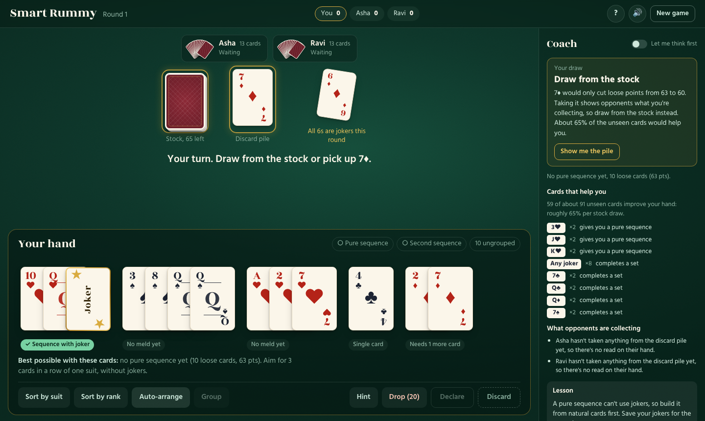
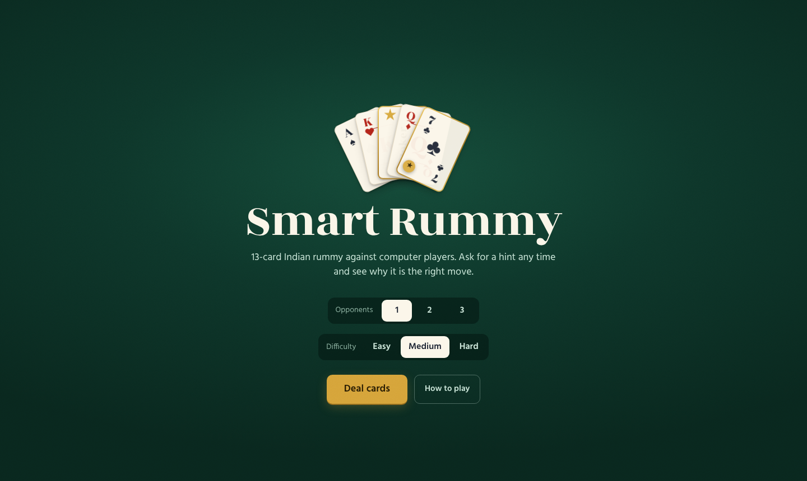

# Smart Rummy

13-card Indian rummy in the browser, played against computer opponents, with a built-in **coach** that tells you the best next move and explains why.



## Features

- **Full game**: draw, discard, group cards into sequences and sets, declare, drop (20 / 40 points), wrong-show penalty (80), round results and running scores over multiple rounds.
- **1-3 bot opponents** on easy, medium or hard. Bots draw, discard and declare using the same hand solver as the coach.
- **Coach** (right-hand panel):
  - best move each turn, with a plain-English reason;
  - a grade for every move you make: *Best move*, *Close* or *Better option*;
  - cards that would help you, how many copies are unseen, and your chance on the next draw;
  - what each opponent is collecting, so you know what not to throw;
  - a short strategy lesson and your match rate with the coach;
  - *Let me think first* mode hides the answer until you've chosen.
- **Hand tools**: live meld labels, sort by suit or rank, auto-arrange, drag-and-drop, keyboard controls.
- **Feel**: dealing and card-flight animations, sound effects with mute, opponent move highlights, reduced-motion support, mobile layout.



## Run it

Backend (FastAPI, port 8000):

```bash
pip install -r requirements.txt
uvicorn app.main:app --reload --port 8000
```

Frontend (React + Vite, port 5173; `/api` is proxied to the backend):

```bash
cd frontend
npm install
npm run dev
```

Open http://localhost:5173.

Tests: `python -m pytest -q` from the project root.

## Project layout

```
app/
  main.py                    FastAPI routes
  models/card.py             Card, suits, ranks, point values
  game/deck.py               Two-deck shoe, wild-joker cut, dealing
  game/rules.py              Meld classification and declaration validation
  game/engine.py             Turns, bots, drops, declarations, scoring, rounds, event log
  algorithms/hand_partitioner.py   Best grouping of a hand (memoised search)
  algorithms/assistant.py    Discard / pick recommendations with reasoning
  algorithms/coach.py        Best move, outs, opponent reads, lessons
frontend/src/
  App.tsx                    Game screen, state, coach grading
  components/                Table, Hand, PlayingCard, Coach, Log, dialogs
  api.ts                     Typed API client
  fly.ts, sound.ts           Card animations and sound effects
tests/                       pytest suite (rules, solver, hints, coach, API, full games)
```

## How a turn flows

1. `POST /api/game/new` deals a round.
2. You draw (`/draw`), then discard (`/discard`) or declare (`/declare`).
3. While it's a bot's turn, the UI calls `/bot-turn` once per bot, with a short pause, so each move shows on the table and in the log.
4. The UI asks `/coach` after every move for the next best move.
5. A round ends on a valid declaration, a wrong show, a drop or an empty stock. `/next-round` deals the next one; scores carry over.

## API

| Method | Path | Purpose |
| --- | --- | --- |
| POST | `/api/game/new` | New game `{num_players, difficulty}` |
| GET | `/api/game/{id}` | Current public state (includes `events` log, `round_result`) |
| POST | `/api/game/{id}/draw` | `{source: "stock" \| "discard"}` |
| POST | `/api/game/{id}/discard` | `{card_id}` |
| POST | `/api/game/{id}/bot-turn` | Play one bot turn |
| POST | `/api/game/{id}/declare` | `{groups: [[card ids]], finish_card_id}` |
| POST | `/api/game/{id}/check` | Validate groups without penalty (live meld labels) |
| POST | `/api/game/{id}/drop` | Drop the round |
| POST | `/api/game/{id}/next-round` | Deal the next round |
| GET | `/api/game/{id}/assist/pick` | Should I take the discard? |
| GET | `/api/game/{id}/assist/discard` | Best discard with reasoning |
| GET | `/api/game/{id}/assist/arrange` | Best grouping of my hand + how far from a valid declaration |
| GET | `/api/game/{id}/coach` | Best next move, reason, helpful cards, opponent reads, lesson |
